# Postgres → ClickHouse CDC with PeerDB

A local, reproducible change-data-capture pipeline: an e-commerce-shaped
Postgres OLTP database streams inserts/updates/deletes into ClickHouse in
near real-time via [PeerDB](https://github.com/PeerDB-io/peerdb), using
Postgres's native logical replication rather than polling or triggers.

## About this project

This is a portfolio piece, not a tutorial, and it's built to be read that
way. The distinction I'm optimizing for: a tutorial shows the happy path
works; this shows I understand where it stops working, and why — the
difference between "I followed the docs" and "I can own this in
production." Concretely, that means three things this README leads with
rather than buries:

1. **A tool-selection decision with real tradeoffs stated**, not just a
   pipeline built with whatever was in the task description — see
   [Why PeerDB](#why-peerdb-and-not-debezium-fivetran-airbyte-or-triggers).
2. **Evidence over assertion.** Every specific claim below (row counts,
   timing, failure behavior, exact grant sets) was reproduced against this
   project's own running stack — see
   [What this actually proves](#what-this-actually-proves).
3. **Named limitations, not implied completeness.** A senior-looking demo
   that hides its gaps is a worse signal than one that states them — see
   [Production considerations](#production-considerations-what-id-change-for-real).

**If you have two minutes:** read this section, then
[Why PeerDB](#why-peerdb-and-not-debezium-fivetran-airbyte-or-triggers) and
[What this actually proves](#what-this-actually-proves).
**If you're doing technical diligence:** `make up && make smoke`
reproduces the whole thing; every technical claim links to the exact
script or doc section that proves it, so nothing here should require
taking my word for it.

### Competencies this demonstrates

| Area | Where |
|---|---|
| Tool/architecture selection under real tradeoffs (not just implementation) | [Why PeerDB](#why-peerdb-and-not-debezium-fivetran-airbyte-or-triggers) |
| Distributed-systems correctness reasoning (exactly-once handoff, checkpointing, versioned merges) | [`docs/architecture.md`](docs/architecture.md), [engine rationale](docs/architecture.md#clickhouse-table-engine-choice-why-replacingmergetree) |
| Operational maturity — monitoring, alerting signals, failure injection with evidence | [Stage 4](#stage-4-operations-monitoring-schema-evolution-failure-recovery) |
| Security by default (least-privilege access, no `trust` auth, credential separation) | [ClickHouse configuration](#clickhouse-configuration) |
| Derived-data correctness on CDC data (why incremental MVs double-count; reconciliation testing) | [Stage 5](#stage-5-gold-layer-refreshable-materialized-views) |
| Data-integrity edge cases found by testing, not assumed | [schema evolution findings](docs/architecture.md#schema-evolution) |
| Honest scope framing — naming what isn't production-ready | [Production considerations](#production-considerations-what-id-change-for-real) |
| Technical writing that a reviewer can verify, not just read | every code block below is a real command run against this repo |

Every claim in this repo (row counts, propagation timing, failure
behavior) was reproduced against the actual running stack, not asserted
from documentation. See [`docs/architecture.md`](docs/architecture.md) for
the full mechanics and a diagram.

**Contents:** [About](#about-this-project) ·
[Why PeerDB](#why-peerdb-and-not-debezium-fivetran-airbyte-or-triggers) ·
[Results](#what-this-actually-proves) ·
[Quickstart](#quickstart) ·
[What's running](#whats-running-and-why-its-shaped-this-way) ·
[Creating the mirror](#stage-3-creating-the-mirror) ·
[Operations](#stage-4-operations-monitoring-schema-evolution-failure-recovery) ·
[Gold layer](#stage-5-gold-layer-refreshable-materialized-views) ·
[Production considerations](#production-considerations-what-id-change-for-real) ·
[Repo layout](#repo-layout)

## Why PeerDB (and not Debezium, Fivetran, Airbyte, or triggers)

Picking PeerDB wasn't "the assignment said PeerDB" — it's a defensible
choice against the realistic alternatives for this specific problem
(Postgres → ClickHouse, single sink, need to actually understand and test
the internals). Presented with the honest case for each alternative, not a
strawman:

| Approach | What it actually is | Why it's a real option | Why not chosen here |
|---|---|---|---|
| **Debezium + Kafka Connect** (+ a ClickHouse sink connector) | Log-based CDC into Kafka topics, decoupled from the sink by a durable, replayable event log | The right call when **multiple heterogeneous consumers** need the same change stream (a warehouse, a search index, a cache invalidator, an event-driven service) — Kafka's replay and fan-out are the entire point, and Debezium is a decade-plus battle-tested at very large scale | For one Postgres→ClickHouse pipeline, this means standing up and operating Kafka (or a Kafka-compatible broker), Kafka Connect, a schema registry, and a sink connector — four extra systems to run, monitor, and upgrade for a workload PeerDB does with services it ships with out of the box. (There's also a Kafka-less "lightweight" sink-connector mode — narrows the gap, but PeerDB still ships the snapshot+CDC handoff and orchestration as one coherent product rather than an assembly of parts.) |
| **Fivetran / Airbyte** (managed or self-hosted ELT) | Broad source/destination connector catalog, minimal ops burden, SaaS-managed in Fivetran's case | The right call when the priority is **time-to-value and not owning pipeline internals at all** — genuinely the best choice for a team without the appetite to operate CDC infrastructure | The opposite of what this project is for: connector internals are opaque by design, and pricing models built around row/volume metering scale awkwardly with CDC's constant trickle of small changes. I can't demonstrate understanding failure modes I can't see inside of — the entire point of Stage 4 here is reasoning about internals a managed black box wouldn't expose. |
| **Trigger-based CDC** (`AFTER INSERT/UPDATE/DELETE` writing to a shadow table) | Application-level capture, no WAL/logical-replication dependency | Still the pragmatic answer on database tiers that genuinely can't enable `wal_level=logical` | Adds write amplification and lock contention to *every* transaction on the source, and it's silently easy to forget on a new table. Increasingly rare to need this — most managed Postgres offerings now support logical replication (including RDS, Cloud SQL, and Supabase). |
| **PeerDB** | Purpose-built Postgres↔ClickHouse (and other destinations) CDC; ships its own orchestration (Temporal) rather than requiring you to bolt one on | Chosen here because it's (1) one coherent system for exactly this source/destination pair instead of assembled general-purpose parts, (2) exposes the exact primitives — peers, mirrors, publications, replication slots — needed to reason precisely about behavior, which is what made Stage 4's failure-mode testing possible at all, (3) open source and self-hostable, so no per-row metering model to work around | The tradeoff being consciously accepted: a smaller, younger project than Debezium, with a smaller community and less multi-decade production track record. That's a real cost, and worth saying plainly rather than pretending the choice was free. |

Sources: [Altinity's ClickHouse Sink Connector architecture doc](https://github.com/Altinity/clickhouse-sink-connector/blob/develop/doc/architecture.md) and [ClickHouse's own Kafka Connect sink docs](https://clickhouse.com/docs/integrations/kafka/clickhouse-kafka-connect-sink) for the Debezium/Kafka topology described above.

## What this actually proves

Everything below was run against this project's own stack, not summarized
from PeerDB's docs:

- **Initial snapshot**: 6 tables, exact row-count match between Postgres
  and ClickHouse immediately after `CREATE MIRROR`.
- **Live CDC**: an insert, update, and delete against `source-postgres`
  each land in ClickHouse within one sync cycle (~10–20s at this project's
  default settings) — see `scripts/verify_cdc.sh`.
- **Schema evolution**: adding a column propagates automatically; dropping
  or renaming one does *not* — and the failure mode is worse than stale
  data, it's silent per-row data loss on the next update to an affected
  row. Full writeup in `docs/architecture.md`.
- **A streaming gold layer that stays correct under updates and deletes**:
  three refreshable materialized views reconcile *exactly* against the
  same aggregations computed directly in Postgres, including after an
  order is cancelled, a customer's attributes change, and a line item is
  deleted (~20s end to end). The naive alternative, an insert-triggered
  incremental MV, was measured reporting 2,000 for an order whose true
  contribution was 0 — see [Stage 5](#stage-5-gold-layer-refreshable-materialized-views).
- **Failure recovery**: hard-killing `flow-worker` mid-batch (2,000 rows
  in flight) recovered with the exact row count — no loss, no duplicates —
  once the container came back. Also surfaced a real Docker gotcha:
  `restart: unless-stopped` does not fire on `docker kill`, only on an
  actual crash.
- **Pausing a mirror measurably grows the source's retained WAL** (56
  bytes → 121 kB after 500 rows while paused) — a concrete demonstration of
  why an abandoned replication slot is a slow-motion outage on the
  *source* database, not just a staleness problem downstream.
- **The ClickHouse peer runs under a least-privilege user**, not a shared
  admin credential: the full mirror lifecycle (snapshot, streaming CDC,
  and a live schema change) was re-verified end-to-end with `peerdb_etl`
  holding only the exact grants PeerDB's docs specify — nothing broader.

## Status

- [x] Stage 1 — Architecture
- [x] Stage 2 — Minimal setup
- [x] Stage 3 — Creating the mirror, verifying insert/update/delete flow
- [x] Stage 4 — Monitoring, schema evolution, failure recovery,
      table-engine rationale
- [x] Stage 5 — Gold layer: refreshable materialized views, verified by
      reconciliation against the source

## Prerequisites

- Docker + Docker Compose v2 (`docker compose version`)
- ~4 GB free RAM for the stack (11 containers: Postgres source, ClickHouse,
  MinIO, PeerDB's catalog DB, Temporal + admin tools + UI, and PeerDB's own
  API/worker/UI services)
- Ports free on the host: `5432, 8123, 9000, 9001, 9002, 9900, 3001, 7233,
  8085, 8112, 8113, 9901` (peerdb-ui defaults to `3001`, not `3000`, since
  `3000` is commonly already taken by other local dev servers — override
  with `PEERDB_UI_PORT` in `.env` if `3001` is also taken)

## Quickstart

```bash
make up           # starts all 11 containers (PeerDB control plane + source + destination)
make mirror       # creates peers + mirror (waits for PeerDB readiness, injects creds from .env)
make verify       # row-count check + live insert/update/delete test
make gold         # creates the gold layer (refreshable MVs over the mirrored tables)
make verify-gold  # reconciles gold against Postgres, then re-checks it under updates/deletes
```

That's it. `make up` starts the full stack, `make mirror` waits for
PeerDB's SQL interface to become reachable and creates the source/destination
peers and the CDC mirror, and `make verify` runs the end-to-end CDC
verification. `make gold` and `make verify-gold` add and check the
[gold layer](#stage-5-gold-layer-refreshable-materialized-views) on top.

First run pulls several images (PeerDB's flow-api/flow-worker/peerdb-server,
Temporal, ClickHouse, Postgres, MinIO) — expect a few minutes depending on
your connection. Everything after that (including a full
`make reset && make up`) is under a minute since images are cached.

Other useful targets:

```bash
make status   # replication lag, batch history, slot size, per-table counts
make logs     # tail all service logs
make down     # stop, keep data volumes
make reset    # stop and wipe all state (full rebuild on next make up)
```

## Architecture

```mermaid
flowchart LR
    subgraph Source["Source: OLTP"]
        PG[(Postgres 16<br/>ecommerce db)]
        WAL[[WAL<br/>wal_level=logical]]
        SLOT{{Replication slot<br/>peerdb_pub}}
        PG -- writes --> WAL
        WAL -- logical decoding<br/>pgoutput --> SLOT
    end

    subgraph Control["PeerDB control plane"]
        TEMPORAL[Temporal<br/>workflow engine]
        CATALOG[(catalog db<br/>mirror metadata)]
        API[flow-api]
        SNAP[flow-snapshot-worker]
        WORKER[flow-worker]
        API <--> TEMPORAL
        TEMPORAL <--> CATALOG
        TEMPORAL -.orchestrates.-> SNAP
        TEMPORAL -.orchestrates.-> WORKER
    end

    subgraph Stage["Staging"]
        S3[(MinIO / S3<br/>Avro batches)]
    end

    subgraph Dest["Destination: OLAP"]
        CH[(ClickHouse<br/>peerdb db<br/>silver)]
        GOLD[(ClickHouse<br/>gold db)]
        CH -- refreshable MVs<br/>every 10s, FINAL --> GOLD
    end

    SLOT -- 1 . initial snapshot --> SNAP
    SLOT -- 2 . streamed changes --> WORKER
    SNAP -- bulk COPY --> CH
    WORKER -- batched writes --> S3
    S3 -- INSERT ... FROM s3&#40;&#41; --> CH

    UI[peerdb-ui / psql :9900] --> API
```



See [`docs/architecture.md`](docs/architecture.md) for the full mechanics,
failure-mode findings, engine rationale, and every design decision in detail.

---

## What's running, and why it's shaped this way

This repo's `docker-compose.yml` is two things stitched together:

1. **PeerDB's own control plane**, taken from
   [PeerDB's upstream quickstart](https://github.com/PeerDB-io/peerdb/blob/main/docker-compose.yml)
   essentially unmodified (vendored under `peerdb-internal/` — its
   `catalog` metadata DB, Temporal, and flow workers). This isn't
   something you'd hand-roll differently; it's PeerDB's real architecture,
   and reusing it as-is is the correct call for a POC that's demonstrating
   *use* of PeerDB, not reimplementing its internals.
2. **The actual source and destination for this project's pipeline** —
   `source-postgres` and `clickhouse` — which are new services, configured
   specifically for CDC.

| Service | Role | Host port(s) |
|---|---|---|
| `source-postgres` | The OLTP source being mirrored | `5432` |
| `clickhouse` | The OLAP destination | `8123` (HTTP), `9000` (native) |
| `peerdb-server` | SQL interface for `CREATE PEER` / `CREATE MIRROR` | `9900` |
| `peerdb-ui` | Web UI for mirror management + status | `3001` |
| `temporal-ui` | Workflow history / retries / failures for each mirror | `8085` |
| `catalog` | PeerDB's internal metadata store (not the source DB) | `9901` |
| `minio` | S3-compatible staging bucket for Postgres→ClickHouse batches | `9001` (S3 API), `9002` (console) |

### Source Postgres configuration

`source-postgres` is started with three non-default settings, passed as
`command:` flags in `docker-compose.yml` rather than buried in a mounted
config file, so they're visible at a glance:

```
wal_level = logical       # emit enough WAL detail to reconstruct row changes
max_wal_senders = 10      # concurrent replication connections allowed
max_replication_slots = 10
```

`postgres/init/01_schema.sql` also creates a **publication** scoped to an
explicit table list:

```sql
CREATE PUBLICATION peerdb_pub FOR TABLE
    categories, customers, products, orders, order_items, payments;
```

Deliberately not `FOR ALL TABLES` — on a real source DB you don't want a
brand-new table to start silently streaming to your data warehouse the
moment someone runs a migration.

`postgres/init/00_pg-hba-replication.sh` adds one `pg_hba.conf` rule
(`host replication ${POSTGRES_USER} 0.0.0.0/0 scram-sha-256`) because
PeerDB's flow workers connect from another container, and the default
`pg_hba.conf` only trusts replication connections from localhost. Password
auth, not `trust` — a deliberate choice so the local setup doesn't model a
habit you wouldn't want in production.

### The e-commerce schema

`postgres/init/01_schema.sql` (structure) and `02_seed.sql` (~15 customers,
20 products, 30 orders with line items and payments) define a small but
realistic OLTP shape:

```
categories ─┐
            ├─< products ─┐
customers ─< orders ──────┤
                           ├─< order_items
                           └─< payments (via orders)
```

Every table has an explicit primary key. That's load-bearing, not
incidental: Postgres's logical replication needs a primary key (or
`REPLICA IDENTITY FULL`) to include enough of the old row in UPDATE/DELETE
WAL records for a downstream consumer to know which row changed. Default
`REPLICA IDENTITY` is "use the primary key," so no extra configuration is
needed as long as every mirrored table has one.

### ClickHouse configuration

`clickhouse` is created with a dedicated `peerdb` database (via
`CLICKHOUSE_DB`) and, deliberately, **two separate users with two
different jobs** rather than one shared credential:

- **`ch_admin`** (`CLICKHOUSE_USER`/`CLICKHOUSE_PASSWORD`) — a bootstrap
  identity with `CLICKHOUSE_DEFAULT_ACCESS_MANAGEMENT=1`, used only to
  provision the second user below and for ad-hoc operator queries
  (`scripts/verify_cdc.sh`, `scripts/mirror_status.sh`). Nothing
  application-facing ever authenticates as this user.
- **`peerdb_etl`** — the user PeerDB's ClickHouse peer actually connects
  as (see `scripts/create_mirror.sql`), created by
  [`clickhouse/init/01_peerdb_etl_user.sh`](clickhouse/init/01_peerdb_etl_user.sh)
  with exactly the grants
  [PeerDB's own docs](https://docs.peerdb.io/connect/clickhouse) list as
  required — nothing broader:

  ```sql
  GRANT INSERT, SELECT, DROP, CREATE TABLE, ALTER ADD COLUMN ON peerdb.* TO peerdb_etl;
  GRANT CREATE TEMPORARY TABLE, S3 ON *.* TO peerdb_etl;
  ```

  Verified, not just configured: the full mirror lifecycle — initial
  snapshot (`CREATE TABLE` + bulk `INSERT` via S3 staging), streaming CDC
  (`INSERT`/soft-delete), and a live `ALTER TABLE ... ADD COLUMN` on the
  source propagating through (`ALTER ADD COLUMN`) — was re-run end-to-end
  with `peerdb_etl` holding only these grants, with zero permission
  errors. `SHOW GRANTS FOR peerdb_etl` after provisioning:

  ```
  GRANT CREATE TEMPORARY TABLE ON *.* TO peerdb_etl
  GRANT S3 ON *.* TO peerdb_etl
  GRANT SELECT, INSERT, ALTER ADD COLUMN, CREATE TABLE, DROP DATABASE, DROP TABLE, DROP VIEW, DROP DICTIONARY ON peerdb.* TO peerdb_etl
  ```

  (ClickHouse expands the single `DROP` grant into its four constituent
  object-level privileges when displaying it — still scoped to `peerdb.*`
  only.)

`ulimits.nofile` is also raised to 262144, ClickHouse's own documented
recommendation — it's a common footgun to hit "too many open files" under
load with the Docker default.

## Configuration

Copy `.env.example` to `.env` and adjust if you want non-default
credentials:

```bash
SOURCE_PG_USER=ecommerce
SOURCE_PG_PASSWORD=ecommerce
SOURCE_PG_DB=ecommerce

CLICKHOUSE_USER=ch_admin              # bootstrap/admin -- operator queries only
CLICKHOUSE_PASSWORD=ch_admin_password
CLICKHOUSE_ETL_USER=peerdb_etl        # least-privilege -- what the PeerDB peer uses
CLICKHOUSE_ETL_PASSWORD=peerdb_etl_password
```

`scripts/create_mirror.sh` injects credentials from `.env` into the SQL
at apply time via sed — change `.env`, re-run `make mirror`, and the
peers pick up the new values without editing the SQL file.

PeerDB's internal catalog/MinIO credentials are fixed in
`docker-compose.yml` rather than templated — they never leave the Docker
network, so there's nothing to protect by making them configurable.

## Verifying the base stack (before creating a mirror)

```bash
# Source Postgres has the schema and seed data
docker compose exec source-postgres psql -U ecommerce -d ecommerce -c "SELECT count(*) FROM orders;"

# ClickHouse is reachable
docker compose exec clickhouse clickhouse-client --user ch_admin --password ch_admin_password -q "SELECT 1"

# PeerDB's SQL interface is up (default password is "peerdb")
docker compose exec catalog psql "host=peerdb-server port=9900 user=peerdb password=peerdb dbname=postgres" -c "SELECT version();"
```

(That last one only proves the port is listening pre-mirror — full
mirror-creation and verification queries are below, in Stage 3.)

## Stage 3: creating the mirror

Everything in this stage runs through `peerdb-server`'s SQL interface
(port `9900`) — the same Postgres-wire-protocol server `psql` speaks to
your regular databases, just with PeerDB's own SQL dialect (`CREATE PEER`,
`CREATE MIRROR`, ...). That's deliberate: mirror configuration lives as a
checked-in `.sql` file instead of clicks in `peerdb-ui`, so setting this up
is a script, not a memory.

```bash
./scripts/create_mirror.sh
```

This applies [`scripts/create_mirror.sql`](scripts/create_mirror.sql),
which does three things:

1. **`CREATE PEER source_pg FROM POSTGRES`** — registers `source-postgres`
   as a peer, using the same credentials as `.env`.
2. **`CREATE PEER ch_dest FROM CLICKHOUSE`** — registers `clickhouse`,
   connecting over the *native* protocol port (`9000`), not HTTP. Note
   there's no S3/staging config in this statement even though ClickHouse
   mirrors stage through S3 (see `docs/architecture.md`) — that's supplied
   once, stack-wide, via the `PEERDB_CLICKHOUSE_AWS_CREDENTIALS_*` env vars
   already in `docker-compose.yml`, pointed at the bundled MinIO. Per
   PeerDB's own docs, that's what "for PeerDB OSS, a MinIO bucket is
   provided as part of the stack" buys you: one less thing to configure
   per peer.
3. **`CREATE MIRROR pg_to_ch`** — the pipeline itself: `do_initial_copy =
   true` (bulk-copy existing rows, then switch to streaming) and
   `publication_name = 'peerdb_pub'` (use the publication already created
   in `01_schema.sql`, instead of letting PeerDB manage its own). Target
   table names are deliberately *not* schema-qualified
   (`categories`, not `public.categories`) — ClickHouse mirrors reject a
   schema-qualified destination name.

Every statement uses `IF NOT EXISTS`, so the script is safe to re-run.

### What PeerDB creates in ClickHouse

The mirror auto-creates one ClickHouse table per mapped Postgres table,
plus one internal staging table (`_peerdb_raw_pg_to_ch`) that streamed
changes land in before being merged. Inspecting the generated DDL for
`orders` shows the shape every mirrored table gets:

```sql
CREATE TABLE peerdb.orders
(
    `order_id` Int32,
    `customer_id` Int32,
    `status` String,
    `order_total_cents` Int32,
    `created_at` DateTime64(6),
    `updated_at` DateTime64(6),
    `_peerdb_synced_at` DateTime64(9) DEFAULT now64(),
    `_peerdb_is_deleted` UInt8,
    `_peerdb_version` UInt64
)
ENGINE = ReplacingMergeTree(_peerdb_version)
PRIMARY KEY order_id
ORDER BY order_id
```

Three columns PeerDB adds on top of your schema, and why each exists:

- **`_peerdb_version`** — the `ReplacingMergeTree` version column. Every
  sync assigns a monotonically increasing value, so when ClickHouse merges
  duplicate primary keys in the background, the row with the highest
  `_peerdb_version` wins. This is how an `UPDATE` in Postgres becomes
  "latest row wins" in an append-only column store — full rationale for
  why `ReplacingMergeTree` specifically (vs. `MergeTree`/`CollapsingMergeTree`)
  is in [`docs/architecture.md`](docs/architecture.md#clickhouse-table-engine-choice-why-replacingmergetree).
- **`_peerdb_is_deleted`** — a soft-delete tombstone. Logical replication
  delivers Postgres `DELETE`s as their own WAL events, but ClickHouse has
  no cheap way to physically delete one row out of a merged part. PeerDB
  instead inserts a new version of the row flagged `_peerdb_is_deleted = 1`
  — the row is never truly gone until a background merge eventually drops
  it. **This has a real consequence for every query against a mirrored
  table**, covered just below.
- **`_peerdb_synced_at`** — when PeerDB wrote this version, useful for
  measuring replication lag per-row without touching Temporal.

### Verifying the mirror

```bash
./scripts/verify_cdc.sh
```

This does exactly what it says: compares row counts between
`source-postgres` and ClickHouse, then performs a live insert, update, and
delete against the source and polls ClickHouse (up to 60s) to confirm each
one lands. Sample output from an actual run:

```
== Step 1: row counts, source vs. ClickHouse (FINAL, excluding soft-deletes) ==
  categories     source=6      clickhouse=6      OK
  customers      source=15     clickhouse=15     OK
  products       source=20     clickhouse=20     OK
  orders         source=30     clickhouse=30     OK
  order_items    source=34     clickhouse=34     OK
  payments       source=30     clickhouse=30     OK

== Step 2: live CDC test (insert / update / delete) ==
  inserting marker category 'cdc-verify-1784539214'...
  updating order_id=1 status to 'cancelled' (was 'delivered' in seed data)...
  deleting order_items.order_item_id=35...
  polling ClickHouse for propagation (up to 60s)...
  insert propagated: yes
  update propagated: yes
  delete propagated (soft-delete tombstone): yes

CDC verification PASSED.
```

(This script performs real, irreversible writes/deletes against the seed
data each time it runs — that's the point, it's proving live CDC, not a
dry run. Re-run `docker compose down -v && docker compose up -d &&
./scripts/create_mirror.sh` if you want a clean slate.)

**The one gotcha worth internalizing**: because of the soft-delete
tombstone, `SELECT count(*) FROM peerdb.order_items FINAL` after the
delete test returns **35**, not 34 — the deleted row is still physically
present, just flagged. The correct "current state" query for any mirrored
table is:

```sql
SELECT * FROM peerdb.order_items FINAL WHERE _peerdb_is_deleted = 0;
```

Forgetting the `_peerdb_is_deleted = 0` filter is the single easiest way
to silently overcount a CDC-mirrored ClickHouse table. `scripts/verify_cdc.sh`
uses this exact pattern for its row-count comparison in Step 1.

### Watching it work

- **Temporal UI** (`localhost:8085`) — the mirror's initial snapshot
  shows up as one `QRepFlowWorkflow` per table (named
  `clone_pg_to_ch_public_<table>_...`); steady-state CDC runs as a
  long-lived `CDCFlowWorkflow`. This is the real place to see retries and
  failures, not application logs.
- **`peerdb-ui`** (`localhost:3001`) — mirror status, sync history, and
  row/lag charts in a GUI, if you'd rather not query ClickHouse directly.
- **`tctl workflow list`** via `docker compose exec temporal-admin-tools
  tctl workflow list` — the CLI equivalent, useful for scripting.

## Stage 4: operations (monitoring, schema evolution, failure recovery)

Stage 3 proved the pipeline works. Stage 4 is about the question that
actually separates review levels: *what happens when it doesn't?*
Everything summarized here was reproduced live against this project's own
mirror — full detail, evidence, and the exact commands to reproduce each
are in [`docs/architecture.md`](docs/architecture.md#failure-modes-and-recovery-tested-against-this-projects-live-stack).

### Monitoring

```bash
./scripts/mirror_status.sh
```

Queries PeerDB's own metadata store directly (`catalog` Postgres database,
schema `peerdb_stats`) rather than scraping `peerdb-ui` — the same data the
UI's dashboards are built from, but scriptable (CI, cron, an alerting
sidecar). It reports:

- **Replication lag** as `latest_lsn_at_source - latest_lsn_at_target`
  (`peerdb_stats.cdc_flows`) — bytes of WAL generated but not yet applied
  to ClickHouse.
- **Recent sync batches** — rows-per-batch and batch duration
  (`peerdb_stats.cdc_batches`), useful for spotting a mirror that's
  throttling or stalling.
- **Per-table insert/update/delete counts** since the mirror started
  (`peerdb_stats.cdc_table_aggregate_counts`).
- **Replication slot size on the source** (`peerdb_stats.peer_slot_size`)
  — the single most important number to alert on; see WAL retention below.
- **Real errors**, filtered to exclude routine `info`-level lifecycle
  logging (`peerdb_stats.flow_errors` logs *every* lifecycle event —
  "created table X," "replication slot setup complete" — at `info` level
  alongside actual errors, so an unfiltered count is meaningless as a
  health signal).

### Schema evolution

- **Adding a column is fully automatic** — PeerDB detects it and runs the
  matching `ALTER TABLE ... ADD COLUMN` on ClickHouse within one sync
  cycle, logged in `peerdb_stats.schema_deltas_audit_log`.
- **Dropping or renaming a column is not handled**, and it's worse than
  "the column goes stale": because `ReplacingMergeTree` replaces the
  *entire* row on each new version, any row that gets updated *after* a
  rename/drop loses its old-column value entirely (goes blank, not stale)
  — while untouched rows keep the correct historical value indefinitely.
  Nothing about this is logged or alerted anywhere. Treat source-side
  renames/drops as a coordinated migration (pause the mirror, reconcile
  the destination schema, resume) — never assume CDC absorbs them safely.

### Failure and recovery

- **A paused or crashed CDC consumer doesn't degrade gracefully on the
  source** — the replication slot retains WAL indefinitely until it's
  consumed. Measured directly: 56 bytes → 121 kB retained after 500 rows
  written while the mirror was paused. On a real production database with
  real write volume, this is a disk-filling outage waiting to happen, not
  just staleness downstream. Alert on `peerdb_stats.peer_slot_size` /
  `pg_replication_slots`, not just mirror lag.
- **A hard-killed `flow-worker` recovers with exact data integrity** — a
  2,000-row insert issued right as the worker was `SIGKILL`'d landed at
  exactly 2,000 rows once the container came back, no loss or
  duplication, because progress checkpoints against the replication
  slot's confirmed LSN.
- **`restart: unless-stopped` did not auto-restart the killed
  container.** Docker treats `docker kill` (like `docker stop`) as
  intentional operator action, not a crash — the restart policy only
  fires on the container exiting on its own. In production, that's an
  orchestrator's job (liveness probes), not something a compose restart
  policy alone covers.
- **The crash never appeared as a "failure" in Temporal's workflow
  history.** That's Temporal's task-queue model working as designed —
  workers are interchangeable, so one disappearing is invisible at the
  workflow level as long as a replacement picks up the queue within the
  activity heartbeat timeout. Practical implication: don't rely on
  `peerdb_stats.flow_errors` alone to detect a worker outage; pair it with
  container/orchestrator-level health signals.

### ClickHouse table engine choice

PeerDB defaults every mirrored table to
`ENGINE = ReplacingMergeTree(_peerdb_version)`. Short version: CDC
delivers "here is the new full state of this row," and `ReplacingMergeTree`
is the one engine in ClickHouse's `MergeTree` family whose "keep the
highest-versioned row per key" semantics match that directly, without
requiring PeerDB to synthesize `CollapsingMergeTree`-style cancellation
pairs from data that was never expressed that way. Full comparison against
`MergeTree`, `CollapsingMergeTree`/`VersionedCollapsingMergeTree`, and
`AggregatingMergeTree` — with the concrete reasons each of those doesn't
fit — is in
[`docs/architecture.md`](docs/architecture.md#clickhouse-table-engine-choice-why-replacingmergetree).

## Stage 5: gold layer (refreshable materialized views)

Stages 3–4 produce a faithful *silver* layer: the `peerdb` database is a
row-for-row mirror of the OLTP tables. Analysts and dashboards usually want
something else: joined, aggregated, business-shaped tables that stay
current as the source changes. Stage 5 adds that as a `gold` database in
the same ClickHouse, kept fresh by
[refreshable materialized views](https://clickhouse.com/docs/materialized-view/refreshable-materialized-view):

```bash
make gold         # creates gold.* (re-run after editing any clickhouse/gold/*.sql)
make verify-gold  # reconciles gold against Postgres, then re-checks it under updates/deletes
```

| Gold view | Grain | What it exercises |
|---|---|---|
| `gold.orders_enriched` | one row per order | denormalized join of orders + customers + line items + payments |
| `gold.customer_ltv` | one row per customer | rollup that has to *forget* an order when it's cancelled |
| `gold.daily_revenue_by_category` | one row per (UTC day, category) | four-way join + aggregate |

Each one is a full recompute from silver, every 10 seconds, swapped in
atomically:

```sql
CREATE MATERIALIZED VIEW gold.customer_ltv
REFRESH EVERY 10 SECOND
ENGINE = MergeTree ORDER BY customer_id
AS
SELECT ...
FROM (SELECT ... FROM peerdb.customers FINAL WHERE _peerdb_is_deleted = 0) AS c
LEFT JOIN (SELECT ... FROM peerdb.orders FINAL
           WHERE _peerdb_is_deleted = 0 AND status != 'cancelled'
           GROUP BY customer_id) AS o ON o.customer_id = c.customer_id;
```

Every silver read applies `FINAL` and the tombstone filter *inside* a
subquery, so the filter is evaluated against the collapsed, current
version of each row (the same rule from Stage 3, applied consistently).

### Why not an ordinary (incremental) materialized view

The usual ClickHouse answer to "keep an aggregate up to date" is an
incremental MV: an insert trigger that folds each new block into a
`SummingMergeTree`/`AggregatingMergeTree`. On a CDC-fed
`ReplacingMergeTree` that's wrong, because PeerDB expresses every
`UPDATE` as an *insert of a new version*, and the trigger sees each version
before deduplication. Measured on this stack, with an incremental MV
computing per-customer lifetime value:

```
INSERT order (paid, 1000)  -> synced
UPDATE status = 'shipped'  -> synced
UPDATE status = 'cancelled'-> synced

incremental MV contribution for this order (truth: 0): 2000
```

Three versions were inserted, and the trigger summed the first two
(`paid` and `shipped`) as if they were separate orders. A delete arrives
the same way, as one more inserted row (with `_peerdb_is_deleted = 1`), so
it never subtracts anything either. Joins have a further blind spot: an
incremental MV only fires for inserts into the *left-most* table, so a
customer changing country would never touch `orders_enriched`. A full
recompute from `FINAL` has none of these failure modes; the cost is
discussed below.

### Verification: reconciliation against the source

`scripts/verify_gold.sh` doesn't eyeball the output. For each gold view it
runs the equivalent SQL directly in `source-postgres` (the ground truth),
then diffs the two result sets row for row. It then makes exactly the
changes an incremental MV gets wrong (cancel an order, change a customer's
country, delete a line item from a multi-item order, insert a new order
with a payment) and polls until gold reconciles again:

```
== Step 1: reconcile gold against source-postgres (current state) ==
  orders_enriched            rows=30   matches postgres (after 0s)
  customer_ltv               rows=15   matches postgres (after 0s)
  daily_revenue_by_category  rows=27   matches postgres (after 0s)

== Step 2: changes an incremental MV would get wrong ==
  cancelling order_id=30 (its revenue must leave daily_revenue_by_category and customer_ltv)...
  changing customer_id=2's country (every existing order row in orders_enriched must follow)...
  deleting order_items.order_item_id=18 from a multi-item order (item counts and revenue must drop)...
  inserting new order_id=31 with one item and a succeeded payment...
  polling until gold reconciles (CDC sync cycle + 10s refresh; up to 90s)...
  orders_enriched            rows=31   matches postgres (after 20s)
  customer_ltv               rows=15   matches postgres (after 20s)
  daily_revenue_by_category  rows=26   matches postgres (after 20s)

Gold verification PASSED.
```

The ~20s is the end-to-end freshness budget: one PeerDB sync cycle
(~10s) plus up to one refresh interval (10s). Each refresh itself took
~45 ms at this data size (`last_success_duration_ms` in
`system.view_refreshes`).

### What happens when a refresh fails

Tested by dropping a refreshable MV's source table out from under it, which
is what a `RESYNC MIRROR` does to `peerdb.*` for a moment:

- The view **keeps serving its last successful result**. Readers see stale
  data, not an error and not an empty table.
- `system.view_refreshes` shows the error in `exception` and an increasing
  `retry` count. It keeps retrying on schedule.
- Once the source table came back, the next refresh **recovered on its own**
  (`retry` back to 0, `exception` cleared) with no manual step.

That's the right default for a dashboard, but it means a broken gold view
looks *healthy* to anyone just reading it. `make status` now ends with a
gold section that surfaces `exception`, `retry`, and `last_success_time`.
Those, not the data, are what to alert on.

### Design choices worth naming

- **Gold lives in its own database, created by `ch_admin`.** The
  `peerdb_etl` user's grants stop at `peerdb.*`, so PeerDB can't modify gold,
  and a resync that recreates silver tables doesn't drop gold with them.
- **Created by a script after the mirror, not at container boot.** A
  refreshable MV's `SELECT` is validated at `CREATE` time, so the silver
  tables must already exist; `create_gold.sh` waits for them.
- **Each view file is drop-and-recreate.** Gold is fully derived, so that
  loses nothing and makes `make gold` the deploy step for SQL changes. The
  cost is a brief window, while it's recreated, where the view doesn't
  exist.
- **Days are bucketed in UTC explicitly** (`toDate(created_at, 'UTC')`) so
  results don't shift with the server's timezone setting.
- **Gold inherits silver's correctness.** The column rename/drop data loss
  from Stage 4 flows straight through into gold. Reconciliation would
  catch it, but nothing in the refresh itself would.

## Production considerations (what I'd change for real)

Named explicitly rather than left implicit, since a portfolio piece should
show awareness of its own scope limits:

- **No TLS anywhere** — Postgres replication, the ClickHouse native
  protocol (`disable_tls = true` in `scripts/create_mirror.sql`), and
  MinIO all run in plaintext. Acceptable inside a single Docker network on
  localhost; not acceptable across any real network boundary.
- **Schema migrations aren't coordinated.** As shown above, column
  drops/renames on the source silently corrupt the destination. A real
  setup needs a migration process that treats the mirror as a dependent
  consumer — pause, migrate both sides, resync, resume — not something
  CDC can be trusted to absorb unattended.
- **Single Postgres instance, single replication slot, no HA.** A real
  source would be a primary with standbys; failing over to a standby
  invalidates a physical replication slot unless it's specifically
  configured as a *logical* failover slot (Postgres 17+) or otherwise
  reconciled — worth calling out precisely because it's the kind of detail
  that's easy to miss until a failover actually happens.
- **No alerting wired up** — `scripts/mirror_status.sh` is a manual/cron
  tool. A real deployment would ship `peerdb_stats` metrics (slot size,
  LSN lag, `flow_errors` where `error_type != 'info'`) to Prometheus/
  Grafana or equivalent, with actual paging thresholds — slot size growth
  in particular, given the WAL-retention failure mode demonstrated above.
- **Table volumes here are tiny by design** (tens of rows) — this proves
  correctness and behavior, not throughput. `snapshot_max_parallel_workers`,
  `snapshot_num_rows_per_partition`, and ClickHouse part-merge tuning are
  all real levers a production initial-load would need that aren't
  exercised at this scale.
- **Gold is a full recompute every 10s.** That's cheap here (~45 ms per
  view at this scale, not load-tested beyond it), but cost grows with
  table size, not change volume. At larger scale I'd limit each refresh to
  a recent window (e.g. the last N days) and append into a target table
  (`REFRESH ... APPEND TO`), or move truly incremental aggregation to a
  streaming engine that understands retractions (RisingWave, Flink,
  Materialize). That adds a system to operate, the same trade-off as the
  Debezium+Kafka row in the tool-selection table.

## Tearing down

```bash
make down      # stop, keep data volumes
make reset     # stop and wipe all data (start fresh on next make up)
```

## Repo layout

```
docker-compose.yml            # full stack: PeerDB control plane + source + destination
Makefile                      # all commands: up, mirror, verify, gold, verify-gold, status, reset
.env.example                  # copy to .env; override credentials here
LICENSE                       # MIT

postgres/
  init/00_pg-hba-replication.sh # allows replication connections from PeerDB's workers
  init/01_schema.sql            # e-commerce schema + publication
  init/02_seed.sql              # seed data for the initial snapshot

clickhouse/
  init/01_peerdb_etl_user.sh    # provisions the least-privilege peerdb_etl user
  gold/*.sql                    # gold database + refreshable MVs (stage 5), applied by create_gold.sh

peerdb-internal/              # vendored, unmodified PeerDB control-plane config
  volumes/
  scripts/

scripts/
  create_mirror.sql            # CREATE PEER x2 + CREATE MIRROR (stage 3)
  create_mirror.sh             # applies create_mirror.sql via peerdb-server
                                # (injects credentials from .env at apply time)
  verify_cdc.sh                # row-count check + live insert/update/delete test
  mirror_status.sh             # monitoring: lag, batch history, slot size, real errors, gold refreshes
  create_gold.sh               # applies clickhouse/gold/*.sql once the mirror's tables exist (stage 5)
  verify_gold.sh               # reconciles gold against Postgres, before and after live changes

docs/
  architecture.md              # CDC mechanics, diagram, engine rationale, failure-mode evidence
```
