# Real-time CDC: Postgres → ClickHouse with PeerDB, plus a self-reconciling gold layer

[](https://github.com/salbifaza/stream-cdc-peerdb/actions/workflows/smoke.yml)
[](LICENSE)


**Dashboards that forget a cancelled order, about 20 seconds after it's
cancelled.**

An e-commerce Postgres database streams every insert, update and delete
into ClickHouse through [PeerDB](https://github.com/PeerDB-io/peerdb),
using Postgres's native logical replication. On top of that mirror sits a
gold layer of business tables: enriched orders, customer lifetime value
and daily revenue by category. `make smoke` proves it. It recomputes every
gold table directly in Postgres and requires an exact row-for-row match,
before and after cancelling an order, moving a customer to another country
and deleting a line item.

## Results at a glance

| | |
|---|---|
| **Mirror freshness** | Insert, update and delete each land in ClickHouse within one sync cycle (**~10–20 s**) |
| **Gold freshness** | Postgres write → reconciled gold table in **~20 s** (sync cycle + 10 s refresh, ~45 ms per refresh) |
| **Gold correctness** | All 3 gold tables **identical to Postgres**, row for row, checked on every CI run |
| **Crash safety** | `SIGKILL` on the flow worker with 2,000 rows in flight: **0 lost, 0 duplicated** |
| **Source safety** | Pausing the mirror grew retained WAL **56 B → 121 kB** after 500 rows, measured and alerted on |
| **Least privilege** | PeerDB writes as a user holding exactly the grants its docs require, scoped to one database |

## Architecture

```mermaid
flowchart LR
    subgraph Source["Source: OLTP"]
        PG[(Postgres 16<br/>ecommerce db)]
        WAL[[WAL<br/>wal_level=logical]]
        SLOT{{Replication slot<br/>peerdb_pub}}
        PG -- writes --> WAL
        WAL -- logical decoding<br/>pgoutput --> SLOT
    end

    subgraph Control["PeerDB control plane"]
        TEMPORAL[Temporal<br/>workflow engine]
        CATALOG[(catalog db<br/>mirror metadata)]
        API[flow-api]
        SNAP[flow-snapshot-worker]
        WORKER[flow-worker]
        API <--> TEMPORAL
        TEMPORAL <--> CATALOG
        TEMPORAL -.orchestrates.-> SNAP
        TEMPORAL -.orchestrates.-> WORKER
    end

    subgraph Stage["Staging"]
        S3[(MinIO / S3<br/>Avro batches)]
    end

    subgraph Dest["Destination: OLAP"]
        CH[(ClickHouse<br/>peerdb db<br/>silver)]
        GOLD[(ClickHouse<br/>gold db)]
        CH -- refreshable MVs<br/>every 10s, FINAL --> GOLD
    end

    SLOT -- 1 . initial snapshot --> SNAP
    SLOT -- 2 . streamed changes --> WORKER
    SNAP -- bulk COPY --> CH
    WORKER -- batched writes --> S3
    S3 -- INSERT ... FROM s3&#40;&#41; --> CH

    UI[peerdb-ui / psql :9900] --> API
```



- **Silver** (`peerdb.*`): a one-to-one mirror of six OLTP tables
  (`categories`, `customers`, `products`, `orders`, `order_items`,
  `payments`). PeerDB snapshots them first, then streams changes.
- **Gold** (`gold.*`): business tables rebuilt from silver every 10
  seconds by
  [refreshable materialized views](https://clickhouse.com/docs/materialized-view/refreshable-materialized-view)
  ([`clickhouse/gold/`](clickhouse/gold/)).

| Gold table | Grain | What it has to get right |
|---|---|---|
| `gold.orders_enriched` | order | a 4-table join that follows a customer's changed attributes |
| `gold.customer_ltv` | customer | a rollup that *forgets* an order when it's cancelled |
| `gold.daily_revenue_by_category` | UTC day × category | a four-way join + aggregate that shrinks when a line item is deleted |

## Run it in 2 commands

Requires Docker Compose v2 and about 4 GB of free RAM.

```bash
make up      # starts 11 containers: PeerDB control plane, Postgres, ClickHouse, MinIO
make smoke   # creates the mirror and gold layer, then verifies both end to end
```

The first run takes a few minutes to pull images and for Temporal to
initialise. After that, `make reset && make up` takes under a minute. The
gold verification looks like this:

```
== Step 1: reconcile gold against source-postgres (current state) ==
  orders_enriched            rows=30   matches postgres (after 0s)
  customer_ltv               rows=15   matches postgres (after 0s)
  daily_revenue_by_category  rows=27   matches postgres (after 0s)

== Step 2: changes an incremental MV would get wrong ==
  cancelling order_id=30 (its revenue must leave daily_revenue_by_category and customer_ltv)...
  changing customer_id=2's country (every existing order row in orders_enriched must follow)...
  deleting order_items.order_item_id=18 from a multi-item order (item counts and revenue must drop)...
  inserting new order_id=31 with one item and a succeeded payment...
  orders_enriched            rows=31   matches postgres (after 20s)
  customer_ltv               rows=15   matches postgres (after 20s)
  daily_revenue_by_category  rows=26   matches postgres (after 20s)

Gold verification PASSED.
```

Individual steps and tools:

```bash
make mirror       # create peers + mirror (idempotent)
make verify       # row counts + live insert/update/delete
make gold         # create or redeploy the gold views
make verify-gold  # reconcile gold against Postgres
make status       # lag, batch history, slot size, per-table counts, gold refresh health
make logs         # tail all service logs
make down         # stop, keep data
make reset        # stop and wipe everything
```

| UI | URL |
|---|---|
| PeerDB UI (mirror status, sync history) | http://localhost:3001 |
| Temporal UI (workflows, retries, failures) | http://localhost:8085 |
| MinIO console (staging bucket) | http://localhost:9002 |
| ClickHouse HTTP | http://localhost:8123 |

```sql
SELECT * FROM gold.customer_ltv ORDER BY lifetime_value_cents DESC;
```

## Four things that surprised me

I broke the pipeline on purpose and measured what happened. These four
results changed the design or how I'd monitor it.

### 1. The obvious ClickHouse aggregate reported 2,000 for an order worth 0

The usual way to keep an aggregate current in ClickHouse is an
incremental materialized view: an insert trigger feeding a
`SummingMergeTree`. On a CDC mirror that is wrong. PeerDB writes every
`UPDATE` as a new row version, and the trigger sees each version before
deduplication:

```
INSERT order (paid, 1000)    -> synced
UPDATE status = 'shipped'    -> synced
UPDATE status = 'cancelled'  -> synced

incremental MV contribution for this order (truth: 0): 2000
```

Deletes arrive as one more inserted row, so they never subtract anything.
Joins only fire on the left-most table, so a customer changing country
never reaches `orders_enriched`. I switched to refreshable views that
recompute from `FINAL` every 10 seconds and swap the result in
atomically. That has none of these failure modes, and each refresh takes
~45 ms at this size.
→ [Gold layer design](docs/architecture.md#gold-layer-deriving-tables-from-a-replacingmergetree-mirror)

### 2. Renaming a column silently erases data, one row at a time

Adding a source column propagates automatically. Dropping or renaming one
does not, and the failure is worse than a stale column. `ReplacingMergeTree`
replaces the *whole* row on each new version, so any row updated after the
rename loses the old column's value (it goes blank), while untouched rows
keep it. Nothing is logged or alerted. Source renames and drops have to be
a coordinated migration: pause the mirror, migrate both sides, resume.
→ [Schema evolution](docs/architecture.md#schema-evolution)

### 3. A killed worker is invisible to the orchestrator

`SIGKILL` on `flow-worker` mid-batch lost nothing. Progress checkpoints
against the replication slot's confirmed LSN, so all 2,000 rows landed
exactly once when the worker returned. But two things were invisible:

- `restart: unless-stopped` did **not** restart it. Docker treats
  `docker kill` as a deliberate operator action, not a crash.
- Temporal's workflow history showed **no failure at all**. Workers are
  interchangeable, so one vanishing doesn't register at the workflow level.

So `peerdb_stats.flow_errors` alone won't detect a worker outage. You also
need container-level health checks.
→ [Worker crash mid-batch](docs/architecture.md#worker-crash-mid-batch)

### 4. A broken gold view looks perfectly healthy

I dropped a gold view's source table out from under it, which is what
`RESYNC MIRROR` briefly does. The view kept serving its last good result.
Readers saw stale numbers, with no error and no empty table, and it
recovered on its own once the table returned. That's the right behaviour
for a dashboard, but it means you can't monitor gold by looking at it.
`make status` surfaces `exception`, `retry` and `last_success_time` from
`system.view_refreshes`, and those are what to alert on.

**And the one that wasn't a surprise, but is the most important
operational fact:** a paused or dead CDC consumer makes Postgres retain
WAL indefinitely (56 B → 121 kB after 500 rows here). On a busy production
database that fills the disk. Alert on replication slot size, not just
mirror lag.
→ [WAL retention](docs/architecture.md#pausing-backlog-and-wal-retention)

## Why PeerDB?

For one Postgres source and one ClickHouse sink, I wanted a single system
whose internals I could inspect and break.

| Option | Strong when | Why not here |
|---|---|---|
| **PeerDB** ✓ | One source, one sink; you need to see the internals | Younger project with a smaller community than Debezium |
| **Debezium + Kafka Connect** | Many consumers need the same change stream | Kafka, Connect, a schema registry and a sink connector to run for one sink |
| **Fivetran / Airbyte** | Time to value matters more than owning internals | Opaque internals; row-metered pricing fits CDC's constant trickle badly |
| **Triggers** | The database can't enable `wal_level=logical` | Write amplification and lock contention on every source transaction |

**What tipped it:** PeerDB exposes the exact primitives (peers, mirrors,
publications, replication slots) needed to reason about failure, ships its
own orchestration with Temporal, and is open source with no per-row
metering.

## What I'd change for production

| Gap | Risk | What I'd do |
|---|---|---|
| No TLS | Plaintext replication, ClickHouse native protocol and MinIO | TLS on every connection |
| Uncoordinated schema migrations | Renames and drops silently erase data (finding #2) | Migration runbook: pause, migrate both sides, resync, resume |
| Single Postgres, single slot | Failover to a standby loses the logical slot | Postgres 17+ logical failover slots |
| No alerting | Slot growth or a dead worker goes unnoticed | `peerdb_stats` (slot size, LSN lag, non-`info` errors) and gold refresh health in Prometheus/Grafana with paging |
| Gold is a full recompute | Cost grows with table size, not change volume | Window each refresh with `REFRESH ... APPEND TO`, or move to a streaming engine with retractions (Flink, RisingWave, Materialize) |
| Tiny data volumes | Proves correctness, not throughput | Load test; tune snapshot parallelism, partition size and ClickHouse merges |

## Under the hood

<details>
<summary><b>Services and ports</b></summary>

`docker-compose.yml` combines PeerDB's own control plane, vendored
unmodified from [its upstream quickstart](https://github.com/PeerDB-io/peerdb/blob/main/docker-compose.yml)
under `peerdb-internal/`, with this project's source and destination.

| Service | Role | Host port(s) |
|---|---|---|
| `source-postgres` | OLTP source | `5432` |
| `clickhouse` | OLAP destination (`peerdb` silver, `gold`) | `8123` (HTTP), `9000` (native) |
| `peerdb-server` | SQL interface for `CREATE PEER` / `CREATE MIRROR` | `9900` |
| `peerdb-ui` | Mirror management and status | `3001` (override with `PEERDB_UI_PORT`) |
| `temporal-ui` | Workflow history, retries, failures | `8085` |
| `catalog` | PeerDB's internal metadata store | `9901` |
| `minio` | S3-compatible staging for ClickHouse batches | `9001` (S3), `9002` (console) |

Temporal, its admin tools and PeerDB's flow API/workers make up the rest
of the 11 containers.

</details>

<details>
<summary><b>Source Postgres configuration</b></summary>

Three non-default settings, passed as `command:` flags in
`docker-compose.yml` so they're visible at a glance:

```
wal_level = logical
max_wal_senders = 10
max_replication_slots = 10
```

The publication is scoped to an explicit table list, not `FOR ALL TABLES`,
so a new table never starts streaming to the warehouse by accident:

```sql
CREATE PUBLICATION peerdb_pub FOR TABLE
    categories, customers, products, orders, order_items, payments;
```

`postgres/init/00_pg-hba-replication.sh` allows replication connections
from other containers with `scram-sha-256`, not `trust`. Every table has a
primary key, which logical replication needs to identify the row behind an
`UPDATE` or `DELETE`.

</details>

<details>
<summary><b>ClickHouse users and grants</b></summary>

Two users with two jobs:

- **`ch_admin`** bootstraps access management and runs operator queries
  and the gold layer. Nothing in the pipeline authenticates as it.
- **`peerdb_etl`** is what PeerDB connects as
  ([`clickhouse/init/01_peerdb_etl_user.sh`](clickhouse/init/01_peerdb_etl_user.sh)),
  with exactly the grants [PeerDB's docs](https://docs.peerdb.io/connect/clickhouse)
  require:

  ```sql
  GRANT INSERT, SELECT, DROP, CREATE TABLE, ALTER ADD COLUMN ON peerdb.* TO peerdb_etl;
  GRANT CREATE TEMPORARY TABLE, S3 ON *.* TO peerdb_etl;
  ```

The full lifecycle (snapshot, streaming, a live `ADD COLUMN`) was re-run
under only these grants with zero permission errors. Because the grants
stop at `peerdb.*`, PeerDB can't touch `gold`, and a resync that recreates
silver tables doesn't take gold with it.

`ulimits.nofile` is raised to 262144, ClickHouse's documented
recommendation, to avoid "too many open files" under load.

</details>

<details>
<summary><b>What PeerDB creates, and why you must query with <code>FINAL</code></b></summary>

PeerDB creates one `ReplacingMergeTree` table per source table and adds
three columns:

```sql
CREATE TABLE peerdb.orders
(
    `order_id` Int32,
    ...
    `_peerdb_synced_at` DateTime64(9) DEFAULT now64(),
    `_peerdb_is_deleted` UInt8,
    `_peerdb_version` UInt64
)
ENGINE = ReplacingMergeTree(_peerdb_version)
ORDER BY order_id
```

- `_peerdb_version`: the highest version per key wins when ClickHouse merges.
- `_peerdb_is_deleted`: deletes are soft-delete tombstones, because
  ClickHouse can't cheaply remove one row from a merged part.
- `_peerdb_synced_at`: when this version was written, for per-row lag.

So the correct current-state query for any mirrored table is:

```sql
SELECT * FROM peerdb.order_items FINAL WHERE _peerdb_is_deleted = 0;
```

Forget the filter and you count deleted rows. Every gold view applies
`FINAL` and the filter inside a subquery, so it runs against the current
version of each row.
[Why `ReplacingMergeTree`](docs/architecture.md#clickhouse-table-engine-choice-why-replacingmergetree)
rather than `CollapsingMergeTree` or `AggregatingMergeTree`.

</details>

<details>
<summary><b>Mirror configuration</b></summary>

The mirror is a checked-in SQL file
([`scripts/create_mirror.sql`](scripts/create_mirror.sql)) applied
through `peerdb-server`'s Postgres-wire SQL interface. It does not rely on
clicks in the UI.

1. `CREATE PEER source_pg FROM POSTGRES`
2. `CREATE PEER ch_dest FROM CLICKHOUSE`, over the native protocol. S3
   staging comes from stack-wide env vars pointing at the bundled MinIO.
3. `CREATE MIRROR pg_to_ch` with `do_initial_copy = true` and the existing
   `peerdb_pub` publication.

Every statement uses `IF NOT EXISTS`. `scripts/create_mirror.sh` injects
credentials from `.env` at apply time, so changing `.env` and re-running
`make mirror` is enough.

</details>

<details>
<summary><b>Monitoring: <code>make status</code></b></summary>

`scripts/mirror_status.sh` queries PeerDB's `peerdb_stats` schema
directly, the same data the UI uses:

- **Replication lag**: WAL bytes generated but not yet applied
- **Recent batches**: rows and duration per sync
- **Per-table insert/update/delete counts**
- **Replication slot size**: the number to alert on
- **Real errors**: `flow_errors` with routine `info` lifecycle events filtered out
- **Gold refresh health**: `exception`, `retry`, `last_success_time`

</details>

<details>
<summary><b>Repo layout</b></summary>

```
docker-compose.yml       # PeerDB control plane + source + destination
Makefile                 # up, mirror, verify, gold, verify-gold, smoke, status, reset
.env.example             # copy to .env to override credentials

postgres/init/           # replication access, schema + publication, seed data
clickhouse/init/         # least-privilege peerdb_etl user
clickhouse/gold/         # gold database + refreshable MVs
peerdb-internal/         # vendored, unmodified PeerDB control-plane config

scripts/
  create_mirror.sql/.sh  # CREATE PEER x2 + CREATE MIRROR
  verify_cdc.sh          # row counts + live insert/update/delete
  create_gold.sh         # applies gold SQL once silver tables exist
  verify_gold.sh         # reconciles gold against Postgres, before and after changes
  mirror_status.sh       # lag, batches, slot size, errors, gold refreshes

docs/architecture.md     # full mechanics and every failure test in detail
```

</details>

**Going deeper:** [`docs/architecture.md`](docs/architecture.md) covers
logical replication internals, why changes are staged through S3, the
snapshot-to-stream handoff, and each failure test with its reproduction
commands.

## License

[MIT](LICENSE)
