# Architecture

## What this project demonstrates

A change data capture (CDC) pipeline that streams row-level changes from an
OLTP Postgres database into ClickHouse, an OLAP column store, in near
real-time — without touching the source application, without polling, and
without a batch ETL window. This is the standard pattern for feeding an
analytics/BI store or a data warehouse from a transactional system while
keeping the two decoupled.

## Why logical replication instead of polling or triggers

There are three ways to capture changes out of Postgres. It's worth knowing
why the industry converged on logical replication, because it's the question
that usually follows "so how does CDC work":

| Approach | How it works | Why it loses |
|---|---|---|
| **Polling** (`updated_at > last_poll`) | Periodically query for rows changed since last run | Misses hard deletes entirely; can't reconstruct intermediate states between polls; adds read load to the source proportional to poll frequency |
| **Trigger-based** (audit tables) | `AFTER INSERT/UPDATE/DELETE` triggers write to a shadow table | Adds write amplification and lock contention on every transaction on the source; triggers are easy to forget to add to a new table |
| **Log-based (logical replication)** | Read the Write-Ahead Log (WAL) the database already produces for crash recovery | Near-zero overhead on the source (WAL is written regardless); captures every change including deletes, in commit order, exactly once per transaction |

PeerDB uses the third option: Postgres's built-in **logical replication**,
the same mechanism Postgres itself uses for logical standby servers. Nothing
proprietary sits inside Postgres — PeerDB is a client of a public, versioned
protocol.

## The mechanics inside Postgres

Three pieces of native Postgres configuration make this possible (this repo
sets all three — see `docker-compose.yml` and `postgres/init/01_schema.sql`):

1. **`wal_level = logical`** — tells Postgres to include enough information
   in the WAL to reconstruct row contents, not just physical page changes.
   This is required for logical decoding; it's off by default because it
   costs a bit of extra WAL volume.
2. **A replication slot** — a durable bookmark in the WAL. PeerDB creates
   one when a mirror starts. As long as the slot exists, Postgres will
   retain WAL segments the slot hasn't consumed yet, even across a PeerDB
   restart. (The flip side, covered in the README's failure-modes section:
   an abandoned slot with no consumer will grow the WAL without bound.)
3. **A publication** — `CREATE PUBLICATION peerdb_pub FOR TABLE ...`
   (see `postgres/init/01_schema.sql`) declares which tables are exposed to
   logical replication consumers. This repo publishes an explicit table
   list rather than `FOR ALL TABLES`, so adding a table to the schema later
   doesn't silently start streaming it.

Postgres decodes the WAL into a logical change stream (insert/update/delete
+ row data) via an output plugin — PeerDB uses Postgres's built-in
`pgoutput`, the same plugin native logical replication uses, so there's no
extra extension to install on the source.

## PeerDB's components and what each one does

PeerDB isn't a single binary — the docker-compose stack that ships in this
repo is PeerDB's real internal architecture, not incidental complexity:

- **`catalog`** — a small internal Postgres database. Stores PeerDB's own
  metadata: configured peers (source/destination connection info), mirror
  definitions, and sync progress. Not to be confused with `source-postgres`,
  which is the database being mirrored.
- **`temporal`** (+ `temporal-admin-tools`, `temporal-ui`) — a workflow
  orchestration engine. Every mirror is a long-running Temporal workflow.
  This is what gives PeerDB its recovery story for free: if `flow-worker`
  crashes mid-batch, Temporal retries the workflow from its last durable
  checkpoint instead of PeerDB needing to hand-roll retry/resume logic.
  `temporal-ui` (port 8085) is a real observability surface — you can watch
  a mirror's workflow history, see retries, and inspect failures.
- **`flow-api`** — gRPC/HTTP control plane. Mirror create/pause/drop
  requests go through here; `peerdb-ui` and the `peerdb` SQL interface both
  talk to it.
- **`flow-snapshot-worker`** — does the one-time initial snapshot (bulk
  `COPY` of existing rows) when a mirror starts.
- **`flow-worker`** — the steady-state CDC consumer. Holds the replication
  slot connection, reads decoded WAL records, batches them, and writes to
  the destination connector (ClickHouse, in this repo).
- **`peerdb` (peerdb-server)** — exposes a Postgres-wire-protocol SQL
  interface (port 9900) so you can `psql` into it and run PeerDB's SQL
  dialect: `CREATE PEER`, `CREATE MIRROR`, `SELECT * FROM peerdb_mirrors`,
  etc. This is what makes mirror config scriptable/reproducible instead of
  click-ops in a UI.
- **`peerdb-ui`** — the web UI (port 3000) for the same operations, plus
  mirror status/lag dashboards.
- **`minio`** — an S3-compatible object store used as a staging area. This
  matters for the ClickHouse connector specifically (more below).

**Peer** and **mirror** are PeerDB's core vocabulary: a *peer* is a
registered connection to a system (our `source-postgres`, our
`clickhouse`); a *mirror* is a configured pipeline between two peers —
which tables, which mode (CDC vs snapshot-only), sync interval, etc.

## Why changes are staged through S3/MinIO on the way to ClickHouse

ClickHouse is a column store optimized for large batch inserts into
immutable parts — not for row-by-row transactional writes. Sending each WAL
change as an individual `INSERT` would create thousands of tiny parts and
force constant background merges, which is the single most common way
people get bad performance out of ClickHouse. So `flow-worker` batches
changes, writes them as Avro/Parquet to the MinIO bucket, and has
ClickHouse pull each batch with `INSERT INTO ... SELECT FROM s3(...)` — one
efficient bulk load per sync interval instead of N tiny ones. In a cloud
deployment this bucket would be real S3/GCS; MinIO is a drop-in
S3-compatible stand-in that keeps the whole stack local and free for this
POC.

## Mirror lifecycle: snapshot, then stream

A mirror doesn't choose between "backfill" and "live stream" — it does both,
handed off without a gap:

1. **Slot creation with exported snapshot.** When a mirror starts, PeerDB
   opens a replication connection and creates the replication slot at a
   specific point in time. Postgres gives back a *snapshot identifier*
   consistent with that exact LSN (log sequence number) — this is the
   critical trick: it means the bulk copy and the change stream have a
   precisely defined handoff point, with no race window where a row could
   be both missed and double-counted.
2. **Initial snapshot.** `flow-snapshot-worker` uses that exported snapshot
   to run a consistent, parallelizable `COPY` of every row that existed at
   slot-creation time, straight into the destination.
3. **CDC streaming.** Once the snapshot finishes, `flow-worker` starts
   reading from the replication slot starting at that same LSN, streaming
   every insert/update/delete committed since. Because the slot's start
   LSN and the snapshot's consistency point are the same, nothing that
   happened during the (potentially long) initial copy is lost or
   duplicated.
4. **Steady state.** `flow-worker` keeps consuming the slot, batching
   changes on a configurable sync interval, and advancing the slot's
   confirmed position after each successful batch write — that's the
   durable checkpoint that makes restart-safe resumption possible.

## Data flow diagram

```mermaid
flowchart LR
    subgraph Source["Source: OLTP"]
        PG[(Postgres 16<br/>ecommerce db)]
        WAL[[WAL<br/>wal_level=logical]]
        SLOT{{Replication slot<br/>peerdb_pub}}
        PG -- writes --> WAL
        WAL -- logical decoding<br/>pgoutput --> SLOT
    end

    subgraph Control["PeerDB control plane"]
        TEMPORAL[Temporal<br/>workflow engine]
        CATALOG[(catalog db<br/>mirror metadata)]
        API[flow-api]
        SNAP[flow-snapshot-worker]
        WORKER[flow-worker]
        API <--> TEMPORAL
        TEMPORAL <--> CATALOG
        TEMPORAL -.orchestrates.-> SNAP
        TEMPORAL -.orchestrates.-> WORKER
    end

    subgraph Stage["Staging"]
        S3[(MinIO / S3<br/>Avro batches)]
    end

    subgraph Dest["Destination: OLAP"]
        CH[(ClickHouse<br/>peerdb db)]
    end

    SLOT -- 1 . initial snapshot --> SNAP
    SLOT -- 2 . streamed changes --> WORKER
    SNAP -- bulk COPY --> CH
    WORKER -- batched writes --> S3
    S3 -- INSERT ... FROM s3&#40;&#41; --> CH

    UI[peerdb-ui / psql :9900] --> API
```



## ClickHouse table engine choice: why `ReplacingMergeTree`

Every table PeerDB creates in ClickHouse (confirmed by inspecting the
actual DDL it generated for `orders` in this project — see Stage 3 in the
README) uses:

```sql
ENGINE = ReplacingMergeTree(_peerdb_version)
PRIMARY KEY order_id
ORDER BY order_id
```

ClickHouse's `MergeTree` family is append-only at the storage layer —
there's no in-place row update the way Postgres has one. Every engine in
the family handles "the same primary key showed up again" differently, and
the differences matter a lot for a CDC target specifically:

| Engine | How it handles a repeated key | Why it's/isn't right here |
|---|---|---|
| **`MergeTree`** | Doesn't — every insert is a new, permanent row | Wrong tool for CDC entirely: an `UPDATE` in Postgres would just accumulate duplicate rows in ClickHouse forever with no way to tell which is current |
| **`ReplacingMergeTree(version_col)`** | Background merges keep only the row with the highest `version_col` per primary key; `SELECT ... FINAL` forces this at query time | **What PeerDB uses.** Each CDC sync assigns `_peerdb_version` a monotonically increasing value, so "latest write wins" — the same semantics as the Postgres row it mirrors |
| **`CollapsingMergeTree` / `VersionedCollapsingMergeTree`** | Rows carry a `sign` column (+1/-1); a "cancel" row and the original collapse together on merge | Higher merge throughput for very high-churn tables, but requires the *writer* to emit correctly paired +1/-1 rows — CDC delivers "here's the new state," not "here's a cancellation," so PeerDB would have to synthesize the pairing itself. Not worth the complexity for this workload |
| **`AggregatingMergeTree`** | Merges via an aggregate function per key, not "keep one row" | For pre-aggregated rollups, not for mirroring an OLTP table's current state |

`ReplacingMergeTree` is the closest match to what CDC actually produces —
a stream of "here is the new full state of this row" events — without
requiring PeerDB to track cancellation pairs itself.

**Two things about this that are easy to get wrong**, both found by testing
this project's actual mirror rather than reading about it:

1. **`FINAL` is not automatic.** `SELECT * FROM orders` can return stale
   *and* current versions of the same row side by side until ClickHouse
   gets around to a background merge. Every query against a mirrored
   table needs `FINAL` (`SELECT * FROM orders FINAL`) to get "current
   state" semantics — `scripts/verify_cdc.sh` and `scripts/mirror_status.sh`
   both do this.
2. **Deletes are soft, and versions replace the *whole row*, not
   individual columns.** `_peerdb_is_deleted` marks a row deleted without
   physically removing it (see `_peerdb_is_deleted` in Stage 3), so
   `count(*) FROM t FINAL` overcounts unless you also filter
   `_peerdb_is_deleted = 0`. And because a new version replaces every
   column, not just the ones that logically changed, a source-side schema
   change interacts with this in a way that actually caused silent data
   loss when I tested it — see the schema-evolution section below.

## Failure modes and recovery (tested against this project's live stack)

This section reports what was actually observed running this project's
own mirror, not the general theory — commands to reproduce each are in
`scripts/`.

### Schema evolution

**Adding a column is fully automatic.** `ALTER TABLE products ADD COLUMN
weight_grams INTEGER` on `source-postgres`, followed by an `UPDATE`, was
picked up within one sync cycle: PeerDB detected the new column, ran
`ALTER TABLE products ADD COLUMN weight_grams Int32` against ClickHouse
itself (visible in `peerdb_stats.schema_deltas_audit_log`'s `delta_info`
JSON), and the new value synced correctly. This is what the ClickHouse
connector's `ALTER ADD COLUMN` grant (see the README's Stage 2 section) is
for.

**Dropping or renaming a column is *not* handled, and the failure mode is
worse than "the column goes stale" — it's silent, per-row data loss on
ClickHouse's side.** Tested by renaming `products.description` to
`products.product_description` on the source, then updating one row:

- Every row that wasn't touched by a subsequent `UPDATE` kept its correct,
  frozen `description` value in ClickHouse forever — no error, no alert,
  just permanently stale.
- The one row that *was* updated after the rename went blank in
  `description`. Not stale — **empty.** Here's why: Postgres's logical
  replication describes an `UPDATE` using the table's *current* column
  set, so the WAL record for that row no longer contains a `description`
  field at all. When PeerDB syncs that row, ReplacingMergeTree writes a
  whole new version of the row — and since a version replaces every
  column, not just the ones present in the incoming record,
  `description` gets ClickHouse's zero-value default (`''`) for that
  row's new version, wiping out the historical value.
- No entry appeared in `peerdb_stats.flow_errors` or
  `schema_deltas_audit_log` for either the drop or the rename. Nothing
  about this is surfaced anywhere — you'd only catch it by noticing the
  data looks wrong.

**The practical takeaway**: source-side column renames/drops need to be
treated as a coordinated migration (pause the mirror, `RESYNC MIRROR` or
manually reconcile the destination schema, resume), not something you can
let CDC quietly absorb. This is a real operational gap worth naming
explicitly in a portfolio review, not glossing over.

### Pausing, backlog, and WAL retention

`PAUSE MIRROR pg_to_ch;` / `RESUME MIRROR pg_to_ch;` (via `peerdb-server`'s
SQL interface) work as expected. While paused, writes on `source-postgres`
keep happening normally — Postgres doesn't know or care that the
downstream consumer is paused — and the replication slot retains every
WAL segment since the last confirmed position, because that's exactly
what a replication slot is *for*. Measured directly against this project's
slot (`peerflow_slot_pg_to_ch`) via `pg_wal_lsn_diff(pg_current_wal_lsn(),
restart_lsn)`:

```
before 500-row insert (paused): 56 bytes retained
after  500-row insert (paused): 121 kB retained
```

This is the concrete version of a warning that's easy to wave away in the
abstract: **a paused or crashed CDC consumer doesn't just "fall behind" —
it makes the source Postgres instance retain WAL indefinitely**, which on
a real production database with real write volume will eventually fill
the disk. A replication slot with no consumer is a slow-motion outage on
the *source*, not just a staleness problem on the destination. Alerting on
`peerdb_stats.peer_slot_size.slot_size` (or the equivalent
`pg_replication_slots` query on the source directly) belongs in any
real monitoring setup for this pattern, not just mirror lag.

Resuming the mirror drained the backlog and the slot's retained WAL
dropped back down on the next confirmed checkpoint, exactly as expected.

### Worker crash mid-batch

Killing `flow-worker` (`docker kill -s SIGKILL flow-worker`) immediately
after issuing a 2,000-row insert, then bringing the container back:

- **The row count landed at exactly 2,000 — no loss, no duplicates** — the
  same guarantee the exported-snapshot handoff (see above) provides for
  the initial snapshot extends to steady-state CDC: because progress is
  checkpointed against the replication slot's confirmed LSN, resuming
  re-reads from the same point, never re-delivering already-confirmed
  changes or skipping unconfirmed ones.
- **`restart: unless-stopped` in `docker-compose.yml` did *not* bring the
  container back automatically.** This surprised me and is worth knowing:
  Docker's restart policy treats both `docker stop` and `docker kill` as
  *intentional* operator action and disables auto-restart for that
  container — the policy only fires on a genuine crash the container
  causes itself (non-zero internal exit, OOM-kill by the kernel, etc.).
  Simulating "the process crashed" from outside a container is not the
  same as an actual crash from Docker's perspective. In a real deployment
  this is what an orchestrator's liveness probe (Kubernetes, ECS, Nomad)
  is for — `docker-compose.yml`'s restart policy alone is not a complete
  answer even though it looks like one.
- **Nothing showed up as a "failure" in Temporal's workflow history** for
  this run. That's not a monitoring gap so much as Temporal's task-queue
  model doing what it's designed to do: `flow-worker` instances are
  interchangeable consumers of a durable task queue, not owners of
  in-flight state, so a worker disappearing before (or shortly after)
  claiming its next task is invisible at the workflow level as long as a
  replacement worker picks the task queue back up within the activity's
  heartbeat timeout. The corollary: don't rely on
  `peerdb_stats.flow_errors` alone to detect a worker outage — it will
  stay silent through exactly this scenario. Container-level health
  (`docker compose ps`, or in production, orchestrator restart counts) is
  a separate, necessary signal.

## What to say in an interview

If asked to explain this in one breath: *"PeerDB turns Postgres's own
logical replication WAL stream into a managed, restart-safe pipeline —
Temporal gives it durable checkpointing so a crash mid-sync doesn't lose or
duplicate data, and changes are batched through S3-compatible staging
because ClickHouse is a column store that wants bulk inserts, not
row-by-row writes."* The failure-injection results above (dropped columns
silently blanking data, a paused mirror retaining WAL indefinitely, a
killed worker recovering cleanly but invisibly) are what turns that
sentence from a definition into "I understand the trade-offs, not just the
happy path" — every claim in this doc was reproduced against this
project's own running stack, not asserted from documentation.
